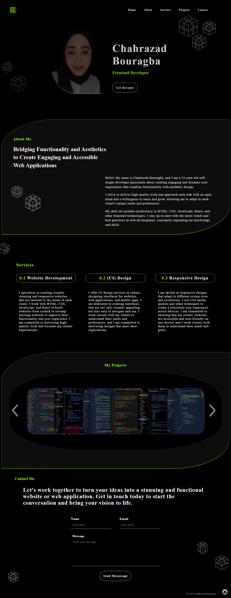

# Portfolio Project


> This is my personal portfolio website, showcasing my work and skills as a developer.


## Overview

Welcome to my Portfolio Project! This is a responsive website that showcases my work and skills as a developer. It features a modern design, smooth animations, and easy navigation.

The website is built using HTML, CSS, and JavaScript. It includes several sections, such as About Me, Projects, Skills, and Contact. Each section is designed to provide a comprehensive overview of my experience and expertise.

## Technologies

- HTML
- CSS
- JavaScript
- Node.js
- Git

## Installation

To get started with this project, you can clone the repository to your local machine using the following command:

```bash
git clone https://github.com/ChahrazadBouragba/Portfolio-Project.git
```
<br><br><br>


