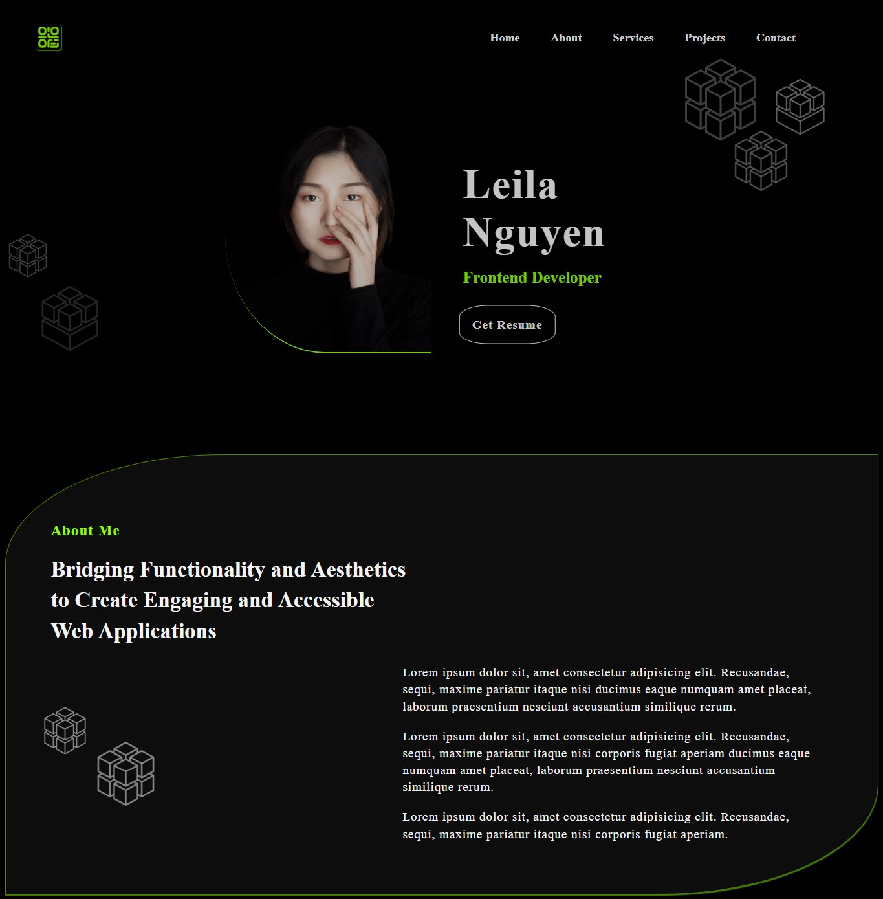

# Portfolio Template

> A stylish and customizable template for showcasing your portfolio and skills as a developer.

## Preview

## Overview

Welcome to the Portfolio Template! This modern and responsive website is designed to help you present your work and skills as a developer in an impressive way. With its sleek design, smooth animations, and user-friendly navigation, it is sure to leave a lasting impression on visitors.

The template is built using HTML, CSS, and JavaScript, providing a solid foundation for customization and flexibility. It includes various sections, such as About, Projects, Skills, and Contact, that allow you to highlight your experience and expertise effectively.

## Technologies

- HTML
- CSS
- JavaScript
- Node.js
- Git

## Getting Started

To start using this portfolio template, follow the steps below:

1. Clone the repository to your local machine.

2. Navigate to the project directory.

3. Open the \`index.html\` file in your preferred web browser to view the template.

## Customization

This portfolio template is highly customizable to match your personal brand and style. Here are a few ways you can customize it:

- Update the content in the HTML files to reflect your own information, such as your bio, education, and work experience.
- Modify the CSS styles to change the colors, fonts, and layout to align with your personal preferences.
- Replace the placeholder images with your own project screenshots or photos.
- Enhance the functionality by adding your own JavaScript code to create interactive elements or implement additional features.

Feel free to unleash your creativity and make this portfolio template truly your own!

## Credits

This portfolio template was designed and developed by Chahrazad Bouragba. You can find the original repository [here](https://github.com/ChahrazadBouragba/Portfolio-Template.git).

## License

This project is licensed under the [MIT License](LICENSE). You are free to use, modify, and distribute this template as per the terms of the license.

